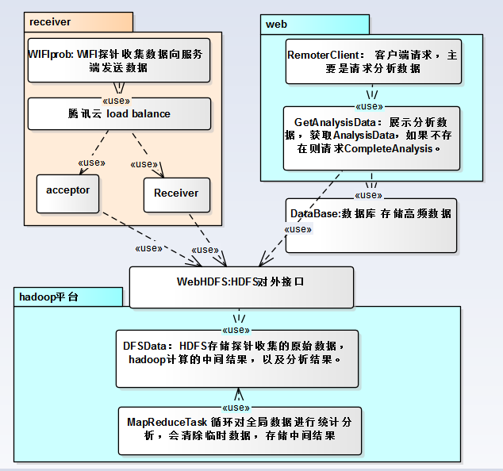
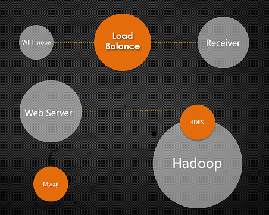
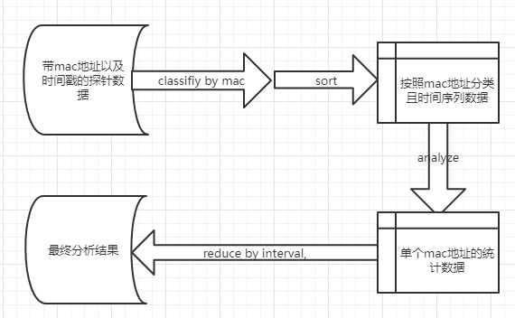
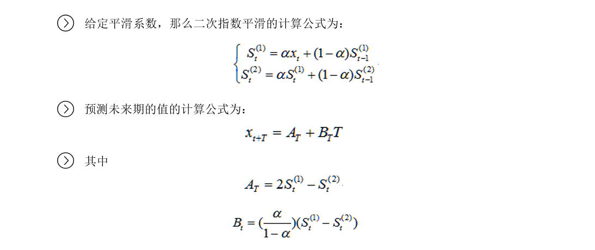
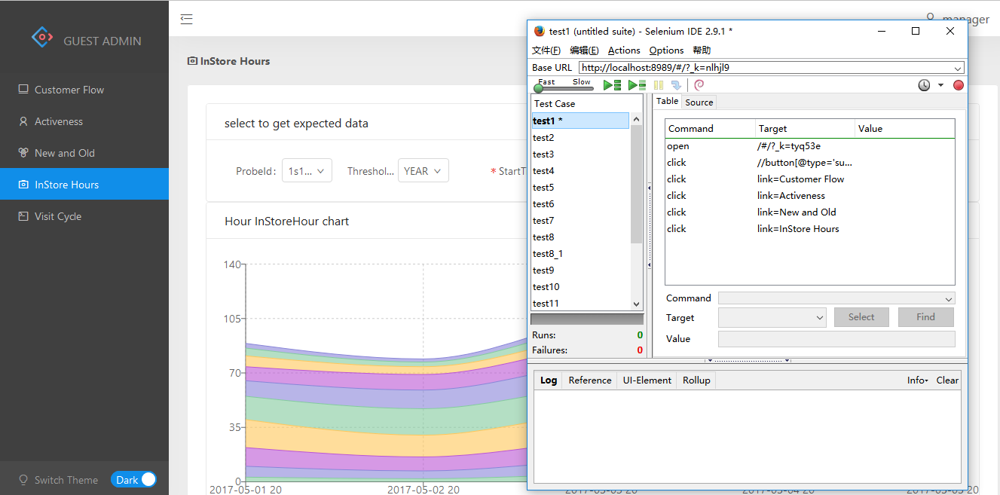
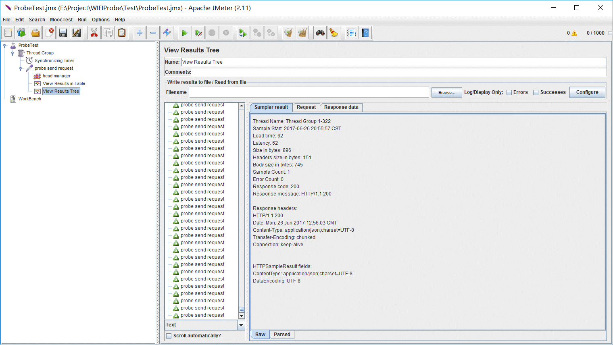
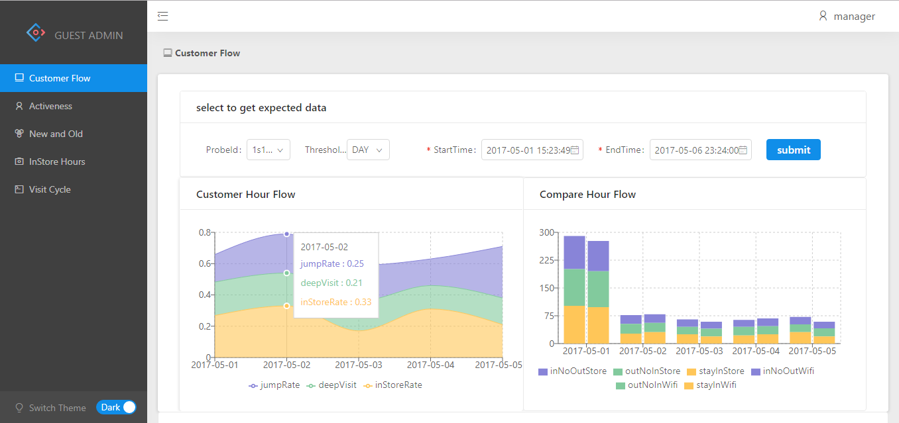
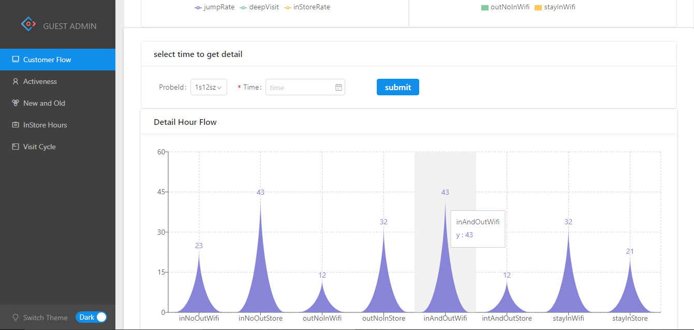
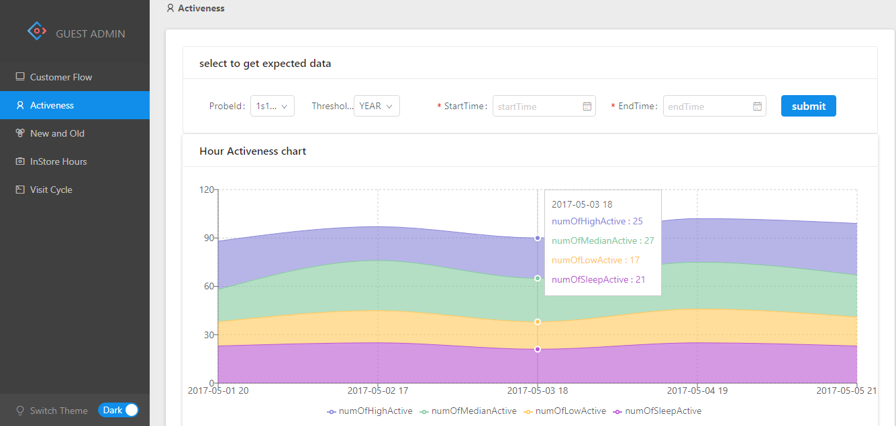
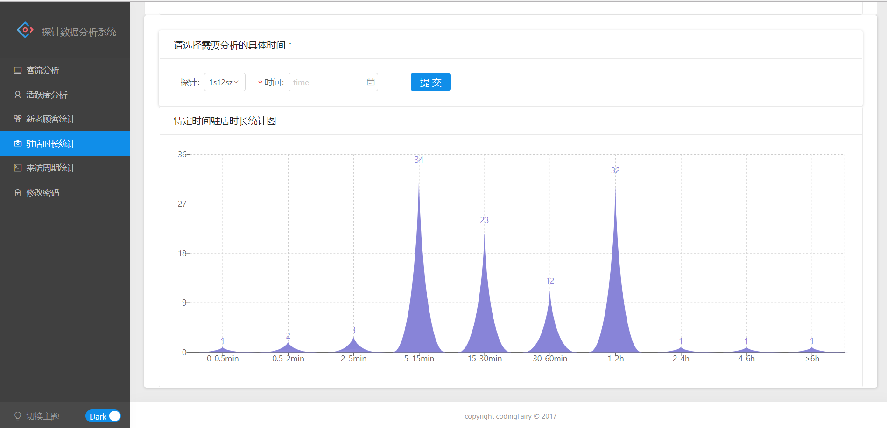

# WIFIProbe
项目文档位于./doc文件夹下，项目展示参考4.Get Started
[查看演示文档](./present.md)

## 1. Introduction
利用智能设备商WIFI模块所发出的无线广播信号进行设备感知，我们可以记录用户的线下行为轨迹。通过采集用户的MAC地址等数据，我们分析了商业环境中门店的门前人流量、进店客流量、进入跳出量、新老顾客数量及新增量、在店平均时长，客流情况等内容。

## 2. Architecture

 * Receiver: 探针将数据发给负载均衡器的虚拟IP，负载均衡器将请求转发给接收服务器，接收服务器发起新线程将数据加入同步缓存，每隔20分钟清空缓存，将合并的大文件传输给HDFS文件系统接口
 * HDFS & Hadoop计算集群:Hadoop计算集群从HDFS文件系统读取数据，循环进行MapReduce操作，将所有的统计结果还保存到文件系统
 * Web：Web服务器定时从HDFS文件系统读取统计结果，将统计结果分类保存到MySQL数据库，提供Restful接口响应HTTP请求，返回要求查看的统计结果以及预测数据
 * MySQL：数据库保存整点信息

### 2.1 Abstract View

## 3. Features

### 3.1 Frameworks

 * [SpringBoot](http://projects.spring.io/spring-boot/)1.5.2.RELEASE:简化新Spring应用的初始搭建以及开发过程。
 * [Swagger](https://swagger.io/)2.0:前后端分离契约
 * [Hadoop](http://hadoop.apache.org/)2.7.1: 充分利用集群的威力进行高速运算和存储
 * [Dva](https://github.com/dvajs/dva): React + Redux 最佳实践
 * [Spring](https://spring.io/)1.5.2.RELEASE: Spring Security 权限控制 + Spring Data JPA持久层框架
 * [JavaFX](http://www.oracle.com/technetwork/java/javase/overview/javafx-overview-2158620.html): Java客户端探针管理工具

### 3.2 Algorithm

#### 3.2.1 Hadoop MapReduce过程说明

 * 第一次 map-reduce  
所有探针数据按照用户MAC地址分类，并按照时间排序，存入HDFS临时文件夹中。
 * 第二次 map-reduce  
我们会对每个用户(mac地址)已排序好的探针数据，统计探针数据在时间轴上的出现密度，由此得出用用户在店内的时间段，继而得出根据单个用户数据统计出来的客户流量，新老客户，回访周期，入店时长这几个统计数据。

#### 3.2.2 预测算法：指数平滑法

### 3.3 Test
 * [Junit](http://junit.org/junit4/) 单元测试套件
 * [Selenium](http://www.seleniumhq.org/) web功能自动化测试
 * [Jmeter](http://jmeter.apache.org/) 性能测试（1000并发测试）

 * 测试环境搭建:

## 4. Get Started

### 4.1 Steps
1. (Optional)将WIFI探针的上传路径指向：http://118.89.208.120/api/v1/receive
2. 访问http://106.15.91.25:8989/#/ 查看数据分析结果
3. 输入用户名；manager    输入密码：manager

### 4.2 Develop Requirements
 * Java 1.8+
 * Maven 3.3.3+
 * JavaScript Language Version: React JSX
 * MySQL 5.6+

## 5. Screenshots

